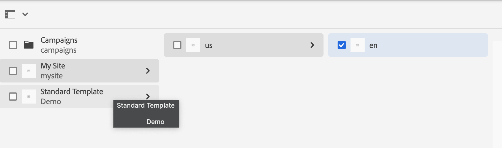
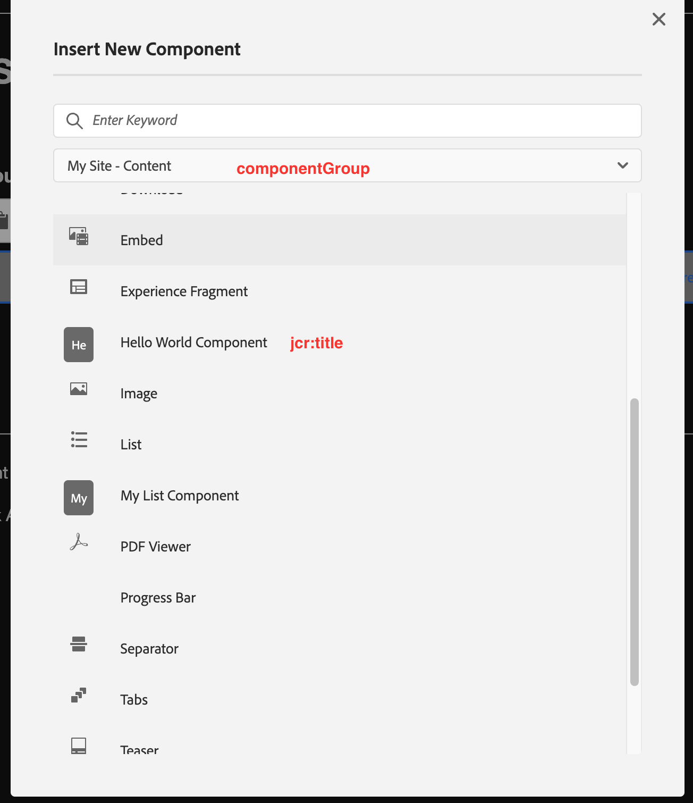
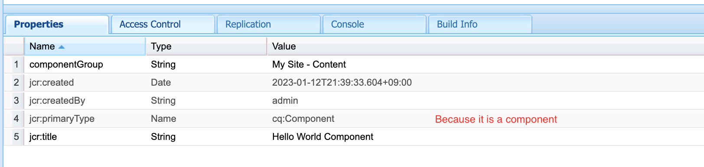
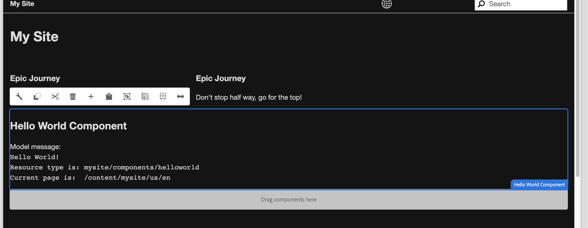
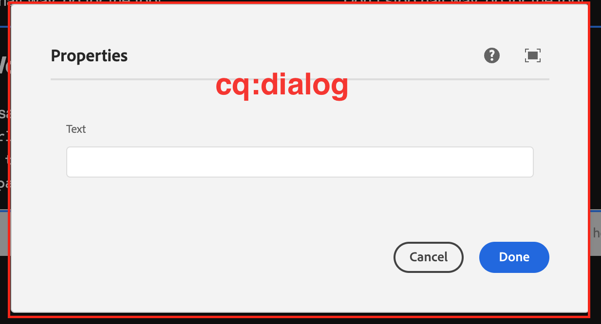

## Prerequisite Setup
### Homebrew Installation
We'll use homebrew to install java, node, etc. [It is like installing package using *apt-get install* in linux]
1. Install homebrew following the instructions from https://brew.sh/
### Java Installation
1. Install Java 11 using homebrew.
```console
brew install java11
```
OR
To manually install  download openJdk from https://jdk.java.net/archive/  (**Note: Avoid Oracle JDK as it is not free for commercial use**)
1. Unzip the archive.
2. Place it to '/opt'.
3. add jdk/bin directory path to the environment.
   **Uninstalling process:**
    1. delete the jdk folder from the /opt
    2. delete the opt/jdk/bin path from the environment


### Maven Installation
1. Download Apache Maven from https://maven.apache.org/download.cgi
2. Install Apache Maven following the instructions from https://maven.apache.org/install.html
3. Place this file to the maven folder. https://experienceleague.adobe.com/docs/experience-cloud-kcs/kbarticles/KA-17454.html?lang=en
## Local AEM Author instance (Cloud Service SDK)
1. Download the latest AEM SDK from https://experience.adobe.com/#/downloads/content/software-distribution/en/aemcloud.html
2. Unzip the downloaded file.
3. Create a folder named `aem-sdk` at a convenient location.
4. Create two sub folders named `author` and `publish` inside `aem-sdk` folder.
5. Copy `aem-sdk-quickstart.jar` file from the unzipped folder (step 2) and paste into `author` an `publish` folder.
6. Rename the quickstart.jar file of `author` folder to `aem-author-p4502.jar`
7. Rename the quickstart.jar file of `publish` folder to `aem-publish-p4503.jar`

## How to Start Author/Publish Instance
1. Open terminal and `cd` into `author` folder.
2. Start the author instance with the following command and wait for a few minutes. (When starting the author instance for the first time, you need to enter and re-enter a password for admin user.)
    ```console
    java -jar aem-author-p4502.jar
    ```
3. After a few minutes, a new tab should be opened in default browser automatically. If it doesn't, go to http://localhost:4502.
4. Similarly, the publish instance can be started.
5. If we need to start AEM instance in debug mode then following command should be executed
```Conosle
java -jar aem-author-p4502.jar -debug 9502
```
Simillar way debugging for publish instance can be executed. Point to be noted that, we will need to use a port after `-debug` command. And it should be non used port. To create similarity between instance port and debug port we can use arbitary port number. For example, as aem uses 4502 port number then we can use 9502 port number for debugging author instance.

## How to Stop Author/Publish Instance
1. Press CTRL-C in the terminal where `java -jar aem-author-p4502.jar` or ``java -jar aem-publish-p4503.jar`` command was issued.
2. Wait until Quickstart Server is safely shut down.

## Configure Agent That Replicates to the Default Publish Instance
1. Go to http://localhost:4502/etc/replication/agents.author.html
2. Click on "Default Agent (publish)"
3. Click edit
4. Check "Enabled" field in "Settings" tab.
5. Make "Agent User Id" field emtpy in "Settings" tab.
6. In "Transport" tab, insert "http://localhost:4503/bin/receive?sling:authRequestLogin=1" in URI field without double quote.
7. In "Transport" tab, put username ("admin") and password ("admin") on "User" and "Password" fields.
8. Click "OK"

## Install Project Archeotype
```
mvn -B org.apache.maven.plugins:maven-archetype-plugin:3.2.1:generate \
 -D archetypeGroupId=com.adobe.aem \
 -D archetypeArtifactId=aem-project-archetype \
 -D archetypeVersion=39\
 -D appTitle="My Site" \
 -D appId="mysite" \
 -D groupId="com.mysite"
```
ref: (https://github.com/adobe/aem-project-archetype)
## Build and Deploy Project to AEM Author Instance
1. Ensure you have an author instance of AEM running locally on port 4502.
2. From the command line navigate into the project directory.
3. Run the following command to build and deploy the entire project to AEM
```console
mvn clean install -PautoInstallPackage
```

## Installing Dispatcher Tools Locally
Local dispatcher tools can be installed following the instructons from the following page.
[Set up local Dispatcher Tools](https://experienceleague.adobe.com/docs/experience-manager-learn/cloud-service/local-development-environment-set-up/dispatcher-tools.html)

## Install and Use Best Practices Analyzer Tool
1. Download "Best Practices Analyzer" tool from https://experience.adobe.com/#/downloads/content/software-distribution/en/aemcloud.html
2. Go to local package manager: http://localhost:4502/crx/packmgr/index.jsp
3. Click **Upload Package** > **Browse** and upload the downloaded zip file from step 1.
4. Click **Install** in the uploaded package.
5. To generate report go to http://localhost:4502/
6. Click **Tools** > **Operations** > **Best Practices Analyzer** > **Generate Report**

## References
- [Local Development Environment Set up](https://experienceleague.adobe.com/docs/experience-manager-learn/cloud-service/local-development-environment-set-up/overview.html?lang=en)
- [Getting Started with AEM Sites - Project Archetype](https://experienceleague.adobe.com/docs/experience-manager-learn/getting-started-wknd-tutorial-develop/project-archetype/overview.html?lang=en)
- [Project Setup](https://experienceleague.adobe.com/docs/experience-manager-learn/getting-started-wknd-tutorial-develop/project-archetype/project-setup.html?lang=en)
- [Using Best Practices Analyzer](https://experienceleague.adobe.com/docs/experience-manager-cloud-service/content/migration-journey/cloud-migration/best-practices-analyzer/using-best-practices-analyzer.html?lang=en#viewing-report)


## Site Template Installation

1. Go to https://github.com/adobe/aem-site-template-standard and download latest *aem-site-template-standard-x.x.x.zip* from the **Release**.
2. Go to Authoring site http://localhost:4502/sites.html/content
3. Select **Create > Site from template > Import** and then select the zip file and follow the wizard

## WKND installation

It can be done by 3 ways.

1. Download Source code and Build.
2. Download prebuilt zip from the release.
3. Using maven command.

*Note!!! the jar provided by the previous doc was actually AEM as a Cloud Service SDK.*

### Source code and build:

1. Go to https://github.com/adobe/aem-guides-wknd and clone/download the zip *master* branch.
2. Follow https://github.com/adobe/aem-guides-wknd#how-to-build .

*Result: WKND site will be seen in http://localhost:4502/sites.html/content

### Prebuilt Zip

1. Go to https://github.com/adobe/aem-guides-wknd/releases
2. Download the zip correspond to the AEM as a Cloud Service SDK.
3. AEM Author>TOOLS> CRXDE Lite> Package ( there are two icon in the navbar one of them is for *Package* or Directly goto http://localhost:4502/crx/packmgr/index.jsp
4. Upload Package> locate the zip and follow the wizard. Note: Don't select *extract*.

\*Result: WKND site will be seen in http://localhost:4502/sites.html/content

### Using maven

1. Create a folder and open terminal.
2. Run the command [Reference:](https://experienceleague.adobe.com/docs/experience-manager-learn/getting-started-wknd-tutorial-develop/project-archetype/project-setup.html?lang=en%5D)

```
mvn -B org.apache.maven.plugins:maven-archetype-plugin:3.2.1:generate \
    -D archetypeGroupId=com.adobe.aem \
    -D archetypeArtifactId=aem-project-archetype \
    -D archetypeVersion=35 \
    -D appTitle="WKND Sites Project" \
    -D appId="wknd" \
    -D groupId="com.adobe.aem.guides" \
    -D artifactId="aem-guides-wknd" \
    -D package="com.adobe.aem.guides.wknd" \
    -D version="0.0.1-SNAPSHOT" \
    -D aemVersion="cloud"

```

Note!!! aemVersion="cloud" because we are using cloud sdk.

## WKND Uninstallation

1. Go to CRX Package Manager ( http://localhost:4502/crx/packmgr/index.jsp )
2. Look at the sidebar under *Group* Portion. Try to find out something having *...wknd* or *com.adobe.aem.guides*.
3. Click on them and see some packages having *wknd*
4. Click on each packages> *More* dropdown> uninstall then delete
5. make sure by searching *wknd* under *All packages* Group.
6. Now Back to the http://localhost:4502/crx/de/index.jsp

Next task to find the *wknd* folder and \[because the appId was wknd\] Delete it.

* Expand **app**
* Expand **conf**
* Expand **content**
    * Expand **experience-fragments**
    * Expand **dam**

## Troubleshooting
### Build command failed CORE.WCM related error.
1. Check Package Manager http://localhost:4502/crx/packmgr/index.jsp
2. Search wcm and see if anything is remained uninstalled.
3. Or https://github.com/adobe/aem-core-wcm-components/releases/tag/core.wcm.components.reactor-2.21.2 and download *core.wcm.components.all-2.21.2.zip* and install it via package manager.
## IDE Setup
### Intellij:Mac: Repo Tool:
**!!!!NOTE: You must have atleast personal license. Educational License can not be used for commercial purpose. And counterfeiting License is also strictly prohibitted.**
*https://github.com/shsteimer/IntelliVault is depricated thats why repo tool is recommended for pushing/pulling content to the crx repository.*
1. Download repo bash from https://github.com/Adobe-Marketing-Cloud/tools/releases
2. Keep it to $HOME/repo. or */opt/repo* as wish.
3. Make it executable by

    ```
    chmod 755 repo
    ```
4. set *＄PATH* variable. Example: if you are using *bash_profile*
    ```
    nano ~/.bash_profile
    ```
    and add
    >export PATH=$HOME/repo:$PATH
5.
    ```
    source ~/.bash_profile
    ```
6. Now follow the documentation wrote on the github [README.md](https://github.com/Adobe-Marketing-Cloud/tools/tree/master/repo#manual-installation)
å
## Create a Component
### Insight of a Component
We have added a **site** and let's call it *My Site*.

Looking inside the page *en*. (open it in *edit* mode)
Here We will add a custom **Component** called *My Component*.

**Before that take a look into  *Hello World Component*.**


*[Disclaimer: This photo is subject to a famous meme on the context upon an intense investigation.]*


#### Insight of Hello World Component



The *jcr* file is at http://localhost:4502/crx/de/index.jsp#/apps/mysite/components/helloworld.



After adding the component a element will be displayed into the page.



This html element is from http://localhost:4502/crx/de/index.jsp#/apps/mysite/components/helloworld/helloworld.html
*Note: it is inside the hello world node.*
Now it is showing a by default element.
To configure the element, click on the *configure* and a dialog will be displayed.
**It is called cq:dialog**



The cq:dialog node is under the *helloworld* component node.
http://localhost:4502/crx/de/index.jsp#/apps/mysite/components/helloworld/cq%3Adialog

**Note:**
* The *sling:resourceType* is *cq/gui/components/authoring/dialog* because it is dialog box.
  if we use another apps's component here **directly and untouched**, in that case there will be no cq:dialog node. but we have to use
  *sling:resourceSuperType*  and value will be its core component address.
  Example: Look into the *List* components used in mysite.
  http://localhost:4502/crx/de/index.jsp#/apps/mysite/components/list
* there will be a *jcr:title* to show the title of the dialog box.

So It might be larking in mind that we may copy a node from the crx and then edit it on the crx window to create a new component. But . . .


*[Disclaimer: This photo is subject to a famous meme on the context on a smart move.]*
#### Insight about codebase in Project dir and IDE:
[Reference: custom-component](https://experienceleague.adobe.com/docs/experience-manager-learn/getting-started-with-aem-headless/spa-editor/angular/custom-component.html?lang=en#update-the-angular-component)
the code seen in the crx manager located in this location with other components with the same group.

*This is the front end code of the Hello World Component. And normally front end code of the this group (My Site - Content) components are stored here.*
>ui.apps>src>main>content>jcr_root>apps>mysite>components>helloworld

A lot of questions may rise in our mind. I think it will now become helpful. https://experienceleague.adobe.com/docs/experience-manager-65/developing/components/components-basics.html?lang=en

The backend java code is:

>core>src>main>java>com.mysite.core>models>HelloWorldModel.java

### Lets Make My Component:
Follow the link https://experienceleague.adobe.com/docs/experience-manager-learn/getting-started-with-aem-headless/spa-editor/angular/custom-component.html


To to add something more there are various example of _cq_dialog.content where some idea could be found.

https://github.com/adobe/aem-core-wcm-components/tree/main/content/src/content/jcr_root/apps/core/wcm/components

The Component Code :
Follow https://github.com/muhammod-ibrahim-khalil/mysite/commit/7725407d2f81a82a972ee37960cc2551602576f2


# Sample AEM project template

This is a project template for AEM-based applications. It is intended as a best-practice set of examples as well as a potential starting point to develop your own functionality.

## Modules

The main parts of the template are:

* core: Java bundle containing all core functionality like OSGi services, listeners or schedulers, as well as component-related Java code such as servlets or request filters.
* it.tests: Java based integration tests
* ui.apps: contains the /apps (and /etc) parts of the project, ie JS&CSS clientlibs, components, and templates
* ui.content: contains sample content using the components from the ui.apps
* ui.config: contains runmode specific OSGi configs for the project
* ui.frontend: an optional dedicated front-end build mechanism (Angular, React or general Webpack project)
* ui.tests: Selenium based UI tests
* all: a single content package that embeds all of the compiled modules (bundles and content packages) including any vendor dependencies
* analyse: this module runs analysis on the project which provides additional validation for deploying into AEMaaCS

## How to build

To build all the modules run in the project root directory the following command with Maven 3:

    mvn clean install

To build all the modules and deploy the `all` package to a local instance of AEM, run in the project root directory the following command:

    mvn clean install -PautoInstallSinglePackage

Or to deploy it to a publish instance, run

    mvn clean install -PautoInstallSinglePackagePublish

Or alternatively

    mvn clean install -PautoInstallSinglePackage -Daem.port=4503

Or to deploy only the bundle to the author, run

    mvn clean install -PautoInstallBundle

Or to deploy only a single content package, run in the sub-module directory (i.e `ui.apps`)

    mvn clean install -PautoInstallPackage

## Testing

There are three levels of testing contained in the project:

### Unit tests

This show-cases classic unit testing of the code contained in the bundle. To
test, execute:

    mvn clean test

### Integration tests

This allows running integration tests that exercise the capabilities of AEM via
HTTP calls to its API. To run the integration tests, run:

    mvn clean verify -Plocal

Test classes must be saved in the `src/main/java` directory (or any of its
subdirectories), and must be contained in files matching the pattern `*IT.java`.

The configuration provides sensible defaults for a typical local installation of
AEM. If you want to point the integration tests to different AEM author and
publish instances, you can use the following system properties via Maven's `-D`
flag.

| Property | Description | Default value |
| --- | --- | --- |
| `it.author.url` | URL of the author instance | `http://localhost:4502` |
| `it.author.user` | Admin user for the author instance | `admin` |
| `it.author.password` | Password of the admin user for the author instance | `admin` |
| `it.publish.url` | URL of the publish instance | `http://localhost:4503` |
| `it.publish.user` | Admin user for the publish instance | `admin` |
| `it.publish.password` | Password of the admin user for the publish instance | `admin` |

The integration tests in this archetype use the [AEM Testing
Clients](https://github.com/adobe/aem-testing-clients) and showcase some
recommended [best
practices](https://github.com/adobe/aem-testing-clients/wiki/Best-practices) to
be put in use when writing integration tests for AEM.

## Static Analysis

The `analyse` module performs static analysis on the project for deploying into AEMaaCS. It is automatically
run when executing

    mvn clean install

from the project root directory. Additional information about this analysis and how to further configure it
can be found here https://github.com/adobe/aemanalyser-maven-plugin

### UI tests

They will test the UI layer of your AEM application using Selenium technology. 

To run them locally:

    mvn clean verify -Pui-tests-local-execution

This default command requires:
* an AEM author instance available at http://localhost:4502 (with the whole project built and deployed on it, see `How to build` section above)
* Chrome browser installed at default location

Check README file in `ui.tests` module for more details.

## ClientLibs

The frontend module is made available using an [AEM ClientLib](https://helpx.adobe.com/experience-manager/6-5/sites/developing/using/clientlibs.html). When executing the NPM build script, the app is built and the [`aem-clientlib-generator`](https://github.com/wcm-io-frontend/aem-clientlib-generator) package takes the resulting build output and transforms it into such a ClientLib.

A ClientLib will consist of the following files and directories:

- `css/`: CSS files which can be requested in the HTML
- `css.txt` (tells AEM the order and names of files in `css/` so they can be merged)
- `js/`: JavaScript files which can be requested in the HTML
- `js.txt` (tells AEM the order and names of files in `js/` so they can be merged
- `resources/`: Source maps, non-entrypoint code chunks (resulting from code splitting), static assets (e.g. icons), etc.

## Maven settings

The project comes with the auto-public repository configured. To setup the repository in your Maven settings, refer to:

    http://helpx.adobe.com/experience-manager/kb/SetUpTheAdobeMavenRepository.html
